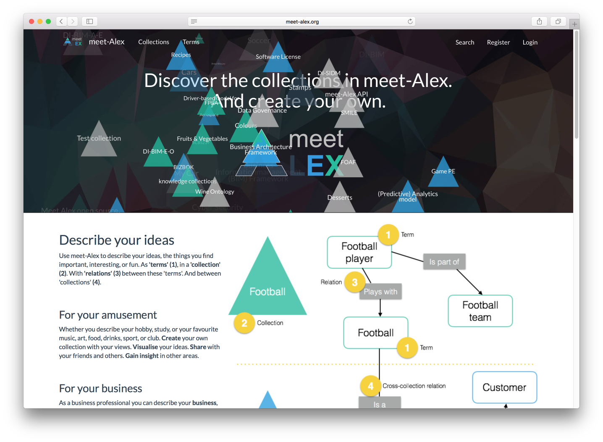
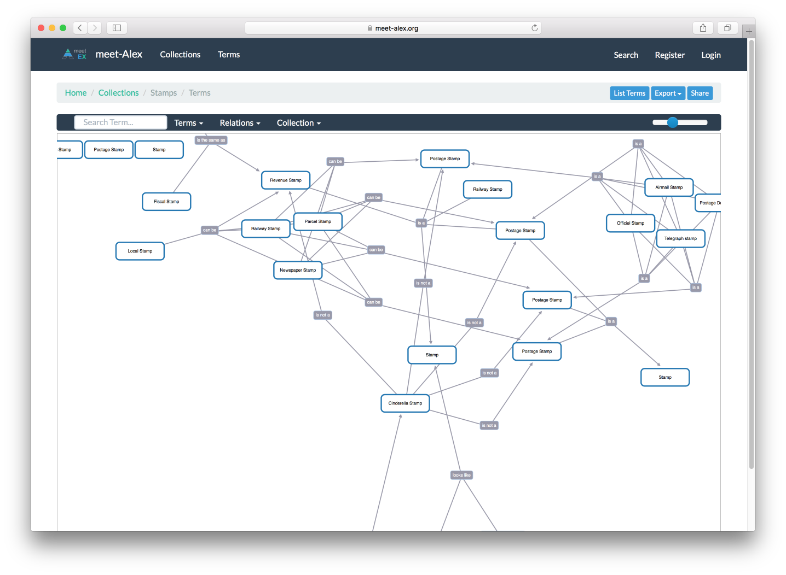

meet-Alex
===================
meet-Alex is an open-source, open community collaboration platform for sharing Vocabularies, Lexicons, Taxonomies and Information Models. The intent is to allow people to work together, create content, re-use each others content and thus speed up digitization of their (work) environment. Meet-Alex features a lightweight fluid responsive design.

It is written in PHP/Laravel + jQuery / HTML / CSS (Bootstrap).




CURRENT FUNCTIONALITY
------------

* Open for everyone; create, share and re-use all Models and Terms directly after registration
* D3js visuals on the term property page with the ability to edit, zoom, collapse, expand, etc.
* Option to set custom relationship types within a Model
* Option to bookmark Models and allow followers to contribute
* Several overviews for Terms and Models, options to filter on model name, term status, owner, etc.
* Option to enable or disable a workflow. When the workflow is enabled collaborating groups need to give approval
* Ability to see the trail of changes on terms
* General settings to change the look and feel of the tool (welcome description, tool name, etc.)
* User screens to maintain users and groups
* Functionality to export and import to Excel
* Functionality to import OWL2 files (wip)
* Rate terms and see the average ratings of terms
* Advanced search dialog to search on term names, definitions and properties
* Functionality to add and delete comments. A gravatar icon will be displayed if the email address is known at gravatar
* Option to clone terms to other Models. When cloning an additional option is provided to immediate create a relation between both Models
* Responsive design for mobile and tablet users
* A set of JSON Api's are available to interactive, communicate with the application
* TinyMCE support for term descriptions, including the upload of images
* Support for OAuth providers

NICE TO HAVE FEATURES
------------

* Personalized dashboard with favourite terms, most frequent visited terms, personal glossaries, etc.
* Option to restore archived terms
* More advanced commenting functionality
* Lifecycle management for workflow enabled Models. Draft, Proposed and Published terms can be maintained side by side.
* Email notification on term changes, new followers, etc.
* Do basic Analytics on term and glossary popularity
* Option to export content to open XML standards (RDF OWL), etc.
* More enriched visuals for terms with filters, glossaries that can be disabled/enabled on the fly, etc.
* More enriched visuals (WordCloud) to navigate through all the term properties.
* MongoDB / NoSQL support for term properties. A database connector is available: https://github.com/jenssegers/laravel-mongodb
* Neo4j database to speed up the visualizations of the ontologies
* Redis cache support and implement Command Query Responsibility Segregation (CQRS), see https://www.grok-interactive.com/blog/command-query-responsibility-segregation/

APPLICATION REQUIREMENTS
------------
* PHP >= 7.0
* MySQL >=5.6
* OpenSSL PHP Extension
* Mbstring PHP Extension
* Tokenizer PHP Extension
* Zip PHP Extension
* Composer
* Git
* NodeJS, be sure that both `node -v` and `npm -v` are working

INITIAL DEPLOYMENT
------------
* Laravel should be configured to have the web server's document / web root to be the public directory
* Install composer: `curl -sS https://getcomposer.org/installer | php — –filename=composer`
* Clone the repository: `git clone https://github.com/meet-Alex/meet-Alex .`
* Run `composer install --no-dev --optimize-autoloader` , use your github key when asked.
* Copy the `.env.example` to `.env` and configure with the correct database settings. If localhost doesn't work, try 127.0.0.1 instead.
* Run `php artisan key:generate` to generate an unique key. Key will be added to APP_KEY in .env configuration file. If not, add it manually.
* Run `php artisan jwt:generate` to generate an unique key for the API authentication method used.
* Change the following variables in the .env file

```
APP_URL=http://localhost
SESSION_DOMAIN=localhost #(take care in setting this variable.  If not set correctly, storage/framework/sessions folder creates a file per every page you visit)

DB_CONNECTION=mysql
DB_HOST=127.0.0.1
DB_PORT=3306
DB_DATABASE=database
DB_USERNAME=username
DB_PASSWORD=password

MAIL_DRIVER=smtp
MAIL_HOST=smtp.gmail.com
MAIL_PORT=587
MAIL_USERNAME=MyUsername
MAIL_PASSWORD=MyPassword
MAIL_ENCRYPTION=null
MAIL_ADDRESS=fromadress@gmail.com
MAIL_NAME="Reply name"
```

* Next step is to deploy the database, use the following command: `php artisan migrate`

Assign to the webserver user if needed:

* run `chown www-data:www-data * -R`
* run `chown www-data:www-data .env -R`
* run `chown www-data:www-data public/.htaccess -R`

Change the read write rights:
* run `chmod -R 777 storage/`
* run `chmod -R 777 bootstrap/cache`

Bring the website up and validate if everything works as expected.
* run `php artisan up`

If you get an error "TokenMismatchException"
* please check the SESSION_DOMAIN setting in the .env file. If this is set wrong, for every click a new session gets generated in storage/framework/sessions folder


CONFIGURATION FOR SOCIALITE
------------
If you encounter issues with Laravel Socialite (InvalidStateException in AbstractProvider.php)
* Set the APP_URL=domain.com and SESSION_DOMAIN=domain.com in the .env file in the www root

DEPLOYMENT WITH HOMESTEAD
------------
* Install homestead: https://laravel.com/docs/5.4/homestead It contains all requirements from above
* Launch VM: 'vagrant up' from Homestead directory
* SSH to VM : 'vagrant ssh'
* SSH to the machine, go the www directory OR HOMESTEAD:~/Homestead$ vagrant ssh
* git clone the source
* Skip the next three steps of underneath:
* HOMESTEAD: Try the site: http://homestead.app/meet-Alex/

UPDATING
------------
* run `php artisan down`
* run `git pull` - to save your credentials permanently using the following: `git config credential.helper store`
* run `composer install`
* run `php artisan migrate`
* run `php artisan config:clear`
* run `php artisan cache:clear`
* run `php artisan route:cache`
* run `chown www-data:www-data * -R`
* run `chown www-data:www-data .env -R`
* run `chown www-data:www-data public/.htaccess -R`
* run `chmod -R 777 storage/`
* run `php artisan up`

DOCKER
------------
Initial docker support has been added. See deploy/docker.md file for more information.
